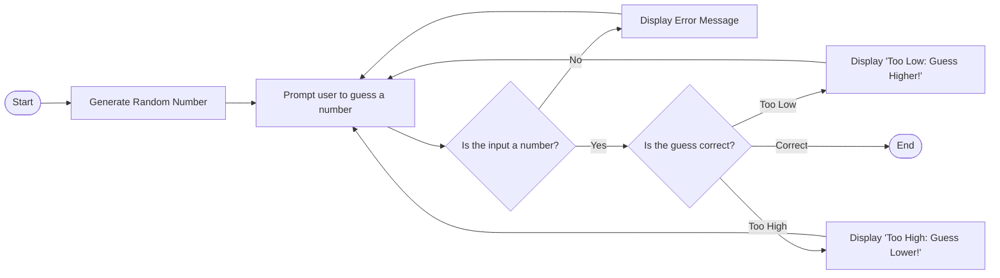

# Number Guessing Game Flowchart

### **Explanation of the diagram process**
- `Start([Start])`: Creates a "Start" node that represents the beginning of the game process.
- `Generate[Generate Random Number]`: Represents the process of generating a random number within a specific range
- `GetInputPrompt user to guess a number]`: Represents prompting the user to input their guess.
- `Validate{Is the input a number?}`: A decision point that checks if the user’s input is valid.
  - `-->|No|`:  If the input is not a valid number, the program displays an error message (Error[Display Error Message]) and prompts the user to guess again (GetInput).
  - `-->|Yes|`: If the input is valid, the program proceeds to the comparison step (Compare).
- `Compare{Is Guess Correct?}`: A decision point where the user’s guess is compared to the randomly generated number
  - `-->|Too Low|`: If the guess is lower than the target number, a message instructs the user to guess a higher number, and the program loops back to GetInput.
  - `-->|Too High|`: If the guess is higher than the target number, a message instructs the user to guess a lower number, and the program loops back to GetInput.
  - `-->|Correct|`: Ends the game if the guess is correct.
